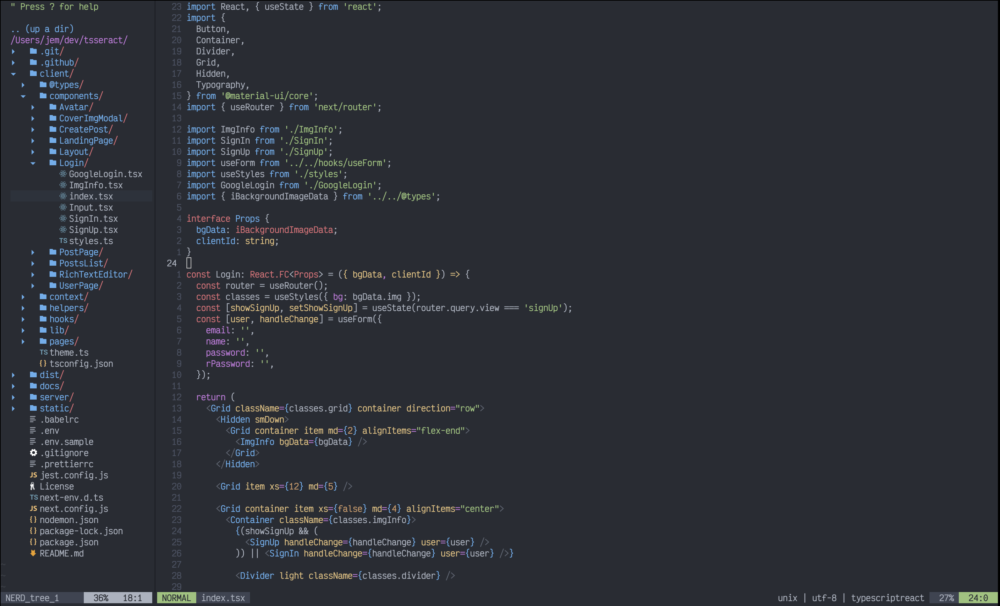

<h1 align="center">NeoVim</h1>

<div align="center">
  

  <p>Custom, easy-to-install NeoVim configuration :rocket:</p>
</div>

### Requeriments

Before running the installation command, you must have [neovim](https://neovim.io) installed.

### Installation

```bash
git clone git@github.com:jeremy2918/nvim.git ~/.config/nvim && nvim
```

### Design


